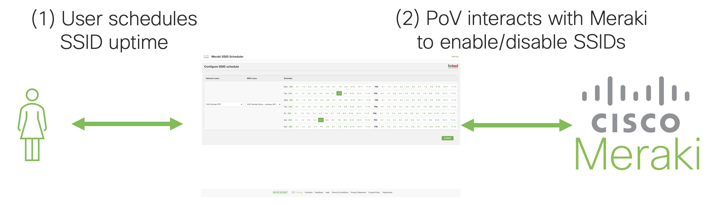
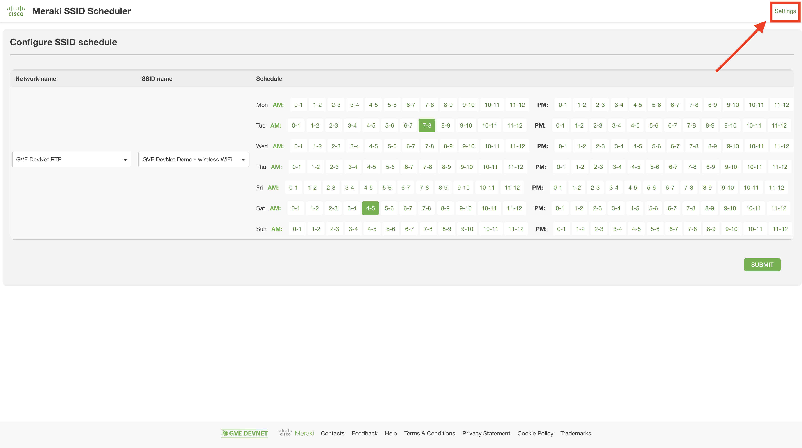
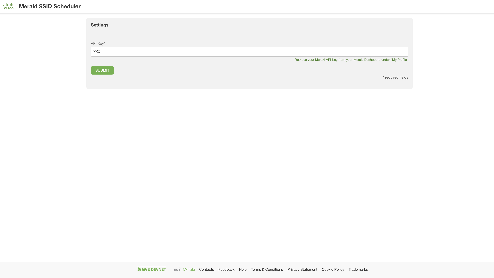
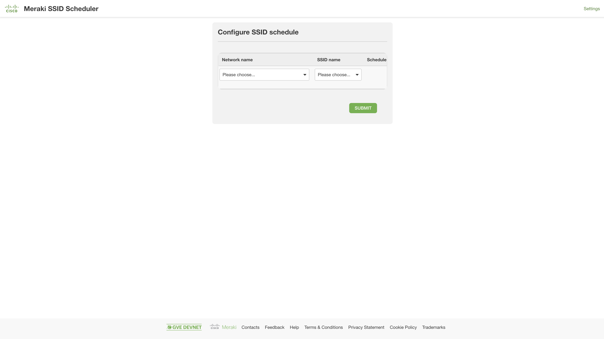
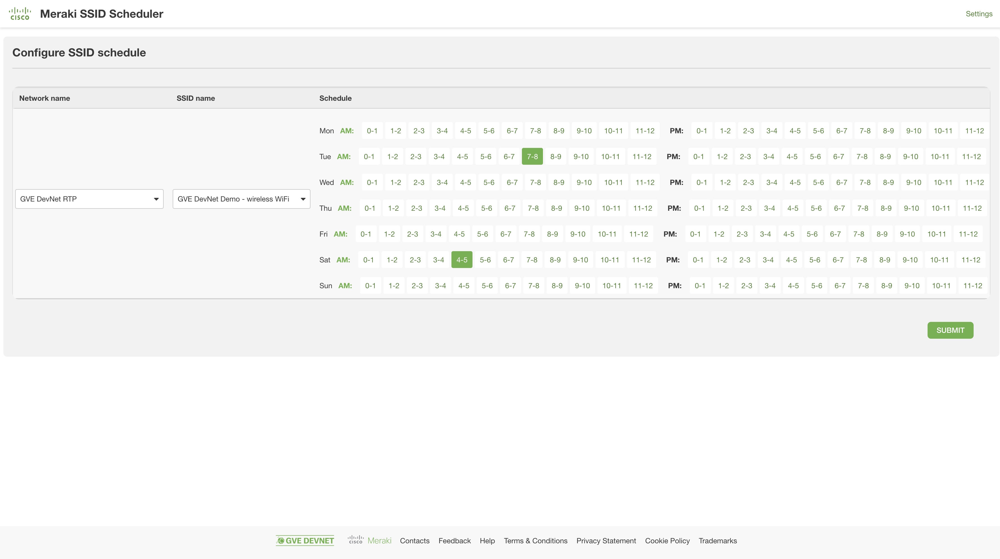
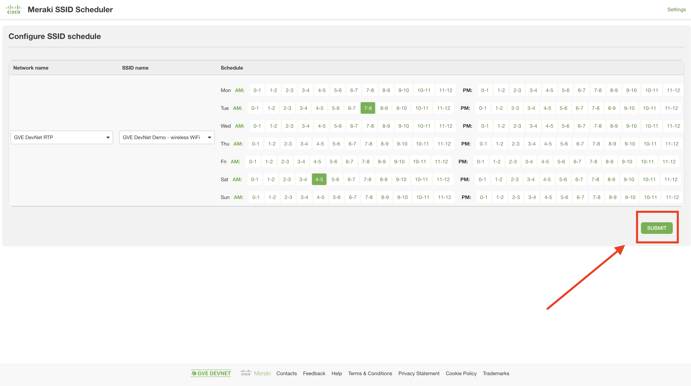
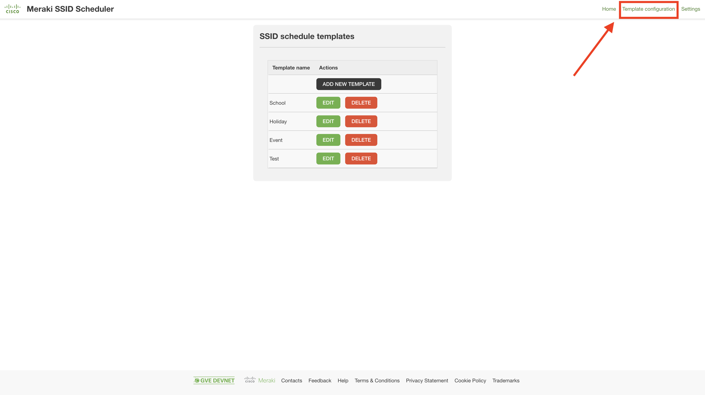

# GVE DevNet Meraki SSID Scheduler
This prototype allows for its user to (1) select a network and SSID, (2) consult the uptime schedule for that SSID, (3) adjust that uptime schedule, and (4) enable that schedule by using Meraki Dashboard APIs. As an added functionality, the user can define "schedule templates" to easily save and load schedules for specific occasions, such as school days/holidays/events.

## Contacts
* Stien Vanderhallen

## Solution Components
*  Meraki REST API
*  Meraki Wireless
*  Meraki

## High Level Overview



## Installation/Configuration

0. In your terminal, clone this repository

```
$ git clone https://wwwin-github.cisco.com/gve/gve_devnet_meraki_ssid_scheduler.git
$ cd gve_devnet_meraki_ssid_scheduler
```

1. In `settings.json`, enter your Meraki API key as `YOUR_MERAKI_API_KEY`. (You can find your Meraki API key under `My Profile` after logging into the [Meraki Dashboard](https://dashboard.meraki.com)) (*Alternatively, skip this step and follow steps 2-8*)

2. Install the required Python libraries

```
$ pip3 install -r requirements.txt
```

3. Start the application (locally OR as a Docker container)

```
$ python3 app.py
```

```
$ docker build . -t merakissidscheduler
$ docker run merakissidscheduler
```

4. In a separate terminal (if you are using a Docker container, a new terminal in your Docker container using `exec -it <container-id> /bin/sh`), start the background script handling SSID shutdown/startup.

```
$ python3 scheduler.py
```

5. (*If you skipped step 1, you are already done*) In a browser, navigate to `localhost:9000`

6. In the top right corner, click `Settings`



7. In the settings page, check your API key, click `Submit` and select the network you want to schedule the switch ports of.



8. Click `Save & Run`. You will be automatically redirected to the landing page.


## Usage

1. On the landing page (`localhost:9000`), select a Meraki network and SSID using the corresponding dropdown menus. 



2. Consult the uptime schedule for your selected SSID.



3. On the right side of the landing page, declare the times at which you want to schedule SSID uptime. Afterwards, click `Submit`. 



4. At any time, you can go back to the settings page by using the top right icon.


5. Configure (add/delete/edit) schedule templates using the "Template configuration" page as linked on the top right of the landing page.



# Screenshots

- Settings page


- Landing page


- Template configuration page


### LICENSE

Provided under Cisco Sample Code License, for details see [LICENSE](LICENSE.md)

### CODE_OF_CONDUCT

Our code of conduct is available [here](CODE_OF_CONDUCT.md)

### CONTRIBUTING

See our contributing guidelines [here](CONTRIBUTING.md)

#### DISCLAIMER:
<b>Please note:</b> This script is meant for demo purposes only. All tools/ scripts in this repo are released for use "AS IS" without any warranties of any kind, including, but not limited to their installation, use, or performance. Any use of these scripts and tools is at your own risk. There is no guarantee that they have been through thorough testing in a comparable environment and we are not responsible for any damage or data loss incurred with their use.
You are responsible for reviewing and testing any scripts you run thoroughly before use in any non-testing environment.
